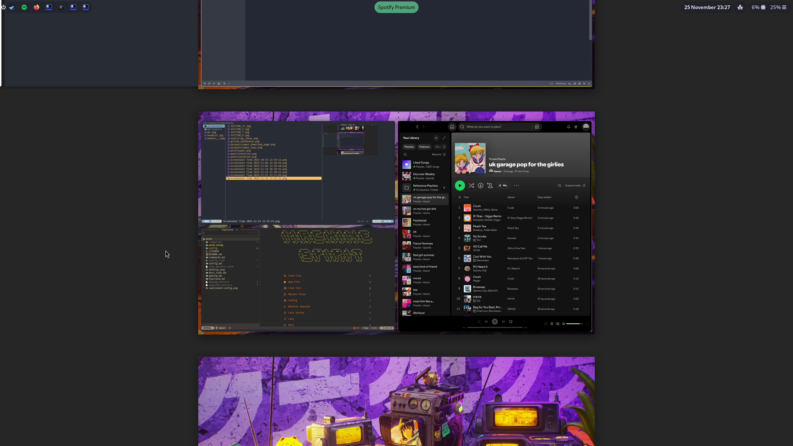

# Arch

This repo contains my setup and configuration for Arch Linux.

## My general desktop setup

- Tiling window manager: Niri
- Init program: systemd
- File explorer: Yazi
- Application launcher: Fuzzel
- Image/media viewer: Feh
- Terminal: Ghostty
- Shell: Fish! 
- Text editors: Neovim/Zed/VSCode
- Top bar: Waybar
- Font: JetBrains NF or FiraCode NF
- Locker: Swaylock (Exec'd by swayidle)
- Idler: Swayidle (as a systemd service)
- Wallpaper: swaybg (as a systemd service)

## This repo setup

- `arch-setup/` - Contains docs on installing and setting up a fresh Arch install.
- `config/` - Contains my dotfiles for commonly configured programs such as Niri, Fish, Neovim, Ghostty, etc. Replicated in a similar structure as a normal `.config` directory (aside from things like `.zshrc` which would live in $HOME) so that directories can just be symlinked across.
- `gaming.md` and others - setup instructions for configuring Arch for specific use cases.

Disclaimer: This repo is purely a place to store my own setup and configuration. I accept no liability for loss or damages that may occur if you copy this setup. Some files (like .zshrc) are from older setups that I'm keeping around in case I switch back.

### Niri

----
### Workspaces

