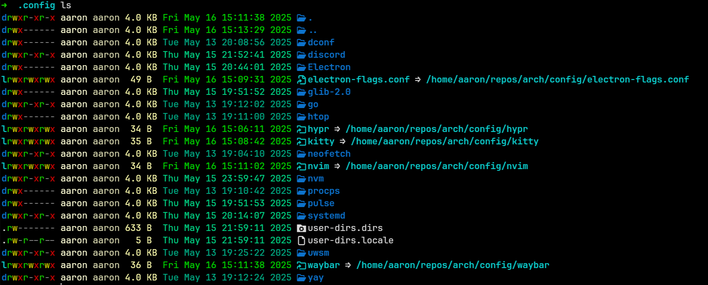

# Configuration

Many programs use `~/.config/` as a place for users to customize their usage, without the risk of updating the program breaking the user's configuration (as is the risk of using a config file located in /etc or /usr).

It's very useful to store this config in Git, as it allows us to quickly get back to a well understood setup on a new installation of Arch.

My commonly saved config files for programs such as Hyprland, Neovim, Kitty etc are stored in `/config` in this repo. The intention is that `/config` will closely match the real systems `~/.config` _and_ we can symlink our `~/.config/<dir>` to our git version. Meaning we only have to edit the Git stored version of the file.

For example, this is my `.config` directory:

## Symlinking

You can perform a symlink using the following command:

`ln -s <real-dir> <fake-link-dir>`

## $CONFIG_DIR

It's useful to store an environment variable such as `$CONFIG_DIR` that points to the git config folder.

`export CONFIG_DIR=/home/aaron/repos/arch/config` (Update path as required).
